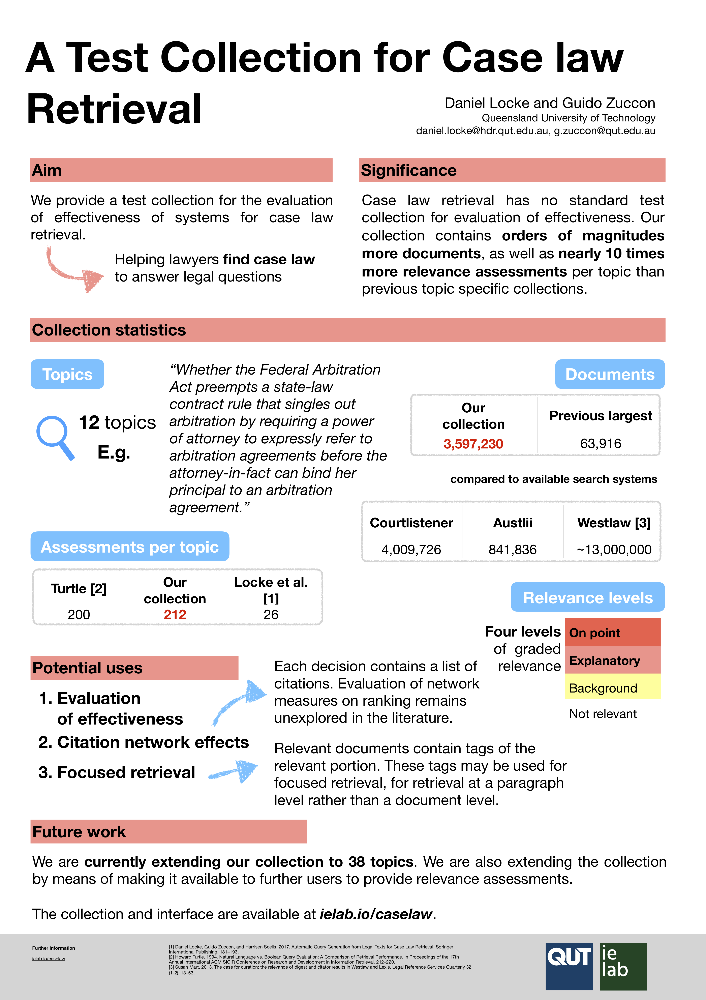

# A Test Collection for Evaluating Legal Case Law Search

Test collection based evaluation represents the standard of evaluation for information retrieval systems. Legal IR, more specifically case law retrieval, has no such standard test collection for evaluation. In this paper, we present a test collection for use in evaluating case law search, being the retrieval of judicial decisions relevant to a particular legal question. The collection is made available at [ielab.io/caselaw](ielab.io/caselaw).

[Download paper](https://dl.acm.org/citation.cfm?id=3210161)

## Poster 



[Download poster](sigir-poster.pdf)

## Citing This Work

Please cite this work as

```
@inproceedings{CaselawCollection,
  title={A Test Collection for Evaluating Legal Case Law Search},
  author={Locke, Daniel and Zuccon, Guido},
  booktitle={The 41st International ACM SIGIR Conference on Research \& Development in Information Retrieval},
  pages={1261--1264},
  year={2018},
  organization={ACM}
}
```

## Contact Authors

Please email [daniel.locke@hdr.qut.edu.au](mailto:daniel.locke@hdr.qut.edu.au).

Follow [@ielabgroup](https://twitter.com/ielabgroup) on twitter.

## Related Work

 - [USSC Caselaw collection](https://github.com/ielab/ussc-caselaw-collection)
